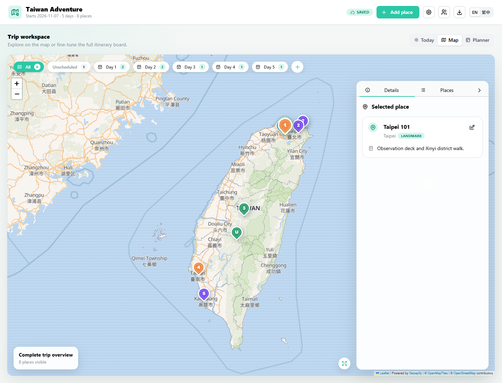

# Trip Planner

A collaborative, map-first workspace for planning a trip and running each travel day. Build an itinerary from saved places, organize nearby stops, track bookings and spending, then use the mobile-friendly Today view while on the move.

Built with React, TypeScript, Mantine, React Leaflet, dnd-kit, and Supabase.



## Features

### Plan visually

- Explore the whole trip, unscheduled ideas, or one day at a time on an interactive map.
- Follow day-numbered and stop-numbered pins with route lines for each ordered itinerary.
- Save categorized places with coordinates, opening hours, notes, and accommodation dates.
- Group places into named location clusters when they are inside one venue, walkable, or in the same area. Each connection can include travel time and transport mode.
- Search and filter the place library, then drag places between unscheduled and itinerary days.
- Add flexible meal, coffee, free-time, or custom placeholders before choosing the exact place.

### Shape each day

- Reorder stops, rename days, choose a default transport mode, and override the mode for individual legs.
- Add planned start times and durations with automatic timing and opening-hours warnings.
- Open a whole-day route or an individual connection in Google Maps.
- Add per-day checklists, reorder tasks, and carry overdue tasks into Today mode.
- Record one-way or round-trip flights and accommodation stays. Check-in, check-out, and flight cards appear on the relevant itinerary day.
- Review a trip activity log showing collaborative place and day changes.

### Travel with Today mode

- Pick the active day and see the current stop, next stop, and full timeline.
- Mark stops current, completed, or skipped without changing the planned itinerary.
- Enable live location to use the device position as the starting point for navigation.
- Check off today's tasks, move overdue tasks forward, and add an expense without leaving the day view.
- Use the responsive Today, Map, Places, Planner, and Expenses views on mobile.

### Track the trip budget

- Record manual expenses by category, day, place, and purchase date.
- Keep flight and accommodation costs attached to their booking so each reservation is counted once.
- Set a whole-trip budget and see totals, category subtotals, remaining budget, and overspending.
- Convert mixed-currency costs into a selected display currency using cached exchange rates.

### Sync, collaborate, and share

- Use passwordless email sign-in and keep multiple trip plans in Supabase.
- Invite collaborators by email with Row Level Security-backed edit access.
- Merge remote collaborator updates with local edits and expose current cloud-save status.
- Create a read-only public link that works without sign-in.
- Continue in local demo mode, with automatic migration of earlier `localStorage` trip data after sign-in.

### Import and export

- Import travel notes, public itinerary links, and Google Maps short links through a review-first AI workflow.
- Copy a plain-text itinerary or download Markdown, multi-sheet Excel, and JSON exports.
- Deploy the Vite build to GitHub Pages with the included GitHub Actions workflow.

The interface supports English and Traditional Chinese.

## Typical workflow

1. Create a trip and collect places manually or with **Import with AI**.
2. Group nearby places, then drag them from **Unscheduled** into each day.
3. Add timing, transport, tasks, flights, stays, and a trip budget.
4. Invite travel companions or send a read-only link.
5. Open **Today** on the trip, enable live location if wanted, and update stops, tasks, and expenses as the day unfolds.

## Import with AI

Select **Import with AI** in the header, then paste travel notes, a public itinerary link, or a Google Maps short link such as `https://maps.app.goo.gl/...`.

- Google Maps links resolve the place name and coordinates directly, then create a reviewable scheduled card under **Imported places**.
- Text and public itinerary links use the configured GPT-5.6/provider model to propose places, notes, timing hints, and day groupings.
- The Supabase Edge Function authenticates the user, enforces quota, validates model JSON, and resolves locations with Geoapify.
- Nothing is added until the traveller reviews and confirms the draft. Existing itinerary data is preserved.
- The model never writes directly to the persisted trip; confirmed imports apply through the existing `TripState` update flow.

The import Edge Function requires an authenticated account and the provider/Geoapify secrets described in [the AI import specification](docs/AI_ITINERARY_IMPORT_SPEC.md).

## Hackathon screenshots

The README hero image is stored in `docs/readme-assets/` so it stays lightweight and tracked. Full hackathon capture folders such as `docs/hackathon-screenshots/` and generated video output under `output/` are local artifacts and are ignored by git.

## Supabase setup

The frontend is configured for project `elqiycppfiafleglqkla` using its public publishable key. No database password, secret key, or service-role key is used by the browser.

### 1. Create the table and security policy

Open **Supabase Dashboard → SQL Editor**, copy `supabase/schema.sql`, and run it once. The script creates the trip and collaborator tables and enables Row Level Security. If the old schema is already installed, rerun this updated script to replace the trip policy and add collaboration support.

### 2. Configure authentication redirects

Open **Authentication → URL Configuration** and add the URLs where the app runs, for example:

```text
http://localhost:5173/
https://<github-username>.github.io/trip-planner/
```

Set the production app URL as the Site URL after GitHub Pages is enabled.

### 3. Optional environment overrides

The checked-in project URL and publishable key allow the existing deployment to work without GitHub secrets. They are public client configuration, not privileged credentials. To point a local or forked build at another project, create `.env.local`:

```bash
VITE_SUPABASE_URL=https://your-project-ref.supabase.co
VITE_SUPABASE_PUBLISHABLE_KEY=sb_publishable_your_key
```

Never add a Supabase secret key, service-role key, database password, or JWT signing secret to Vite environment variables.

## Data and synchronization model

Each authenticated user can own many rows in `public.trip_plans`. Each row has a plan `id`, `owner_id`, read-only `share_token`, and complete `TripState` stored as JSONB. The currently selected plan is automatically saved after edits.

On the first successful login:

1. The app checks Supabase for accessible cloud plans.
2. It opens the `?plan=<id>` deep link, the last opened plan, or the most recently updated accessible plan.
3. If no plan exists, it imports the previous `taiwan-trip-planner:v1` browser data when available; otherwise it creates a blank trip.
4. The selected plan id is remembered per user in browser storage.

The Supabase authentication session still uses browser storage so a device remains signed in, but the itinerary itself is stored in Supabase.

## Sharing a trip

The owner selects **Share trip** in the header and enters a collaborator's email. The collaborator opens the app and uses the existing magic-link sign-in with that exact email; the database claims the pending invitation and grants editor access to that specific trip plan. No password, shared account, or public edit link is used.

The same dialog also creates a **read-only share link**. Anyone with that URL can open the map, places, and planner without signing in, but cannot make changes. The link uses a random token and calls a dedicated Supabase function that only returns the trip JSON; it does not grant anonymous table access or write permission.

Owners can remove a collaborator at any time. Access is enforced by Supabase Row Level Security, not only hidden in the UI.

### Collaborator invitation email

The `send-collaborator-invite` Edge Function saves the invitation using the signed-in owner's RLS permissions, then sends a transactional email through Resend. Configure these Edge Function secrets:

```text
RESEND_API_KEY=re_...
INVITE_FROM_EMAIL=Trip Planner <invites@your-verified-domain.example>
INVITE_APP_URL=https://<github-username>.github.io/trip-planner/
INVITE_ALLOWED_ORIGIN=https://<github-username>.github.io
```

`INVITE_APP_URL` is recommended for production. Without valid email secrets, collaborator access is still saved and the owner is told to share the app link manually. Never expose these values through `VITE_*` variables.

## Local development

```bash
npm install
npm run dev
```

Open the URL shown by Vite and request a magic sign-in link.

## Quality checks

```bash
npm run typecheck
npm test
npm run build
```

## Routing model

Routes are manual and free: drag place cards into your preferred order, select public transport, walking, cycling, or driving for each connection, then open that individual connection in Google Maps. No Google API key, billing account, or Supabase Edge Function is needed.

## Deployment

The included GitHub Actions workflow builds and deploys the `dist` directory to GitHub Pages. In repository settings, set **Pages → Build and deployment → Source** to **GitHub Actions**.
